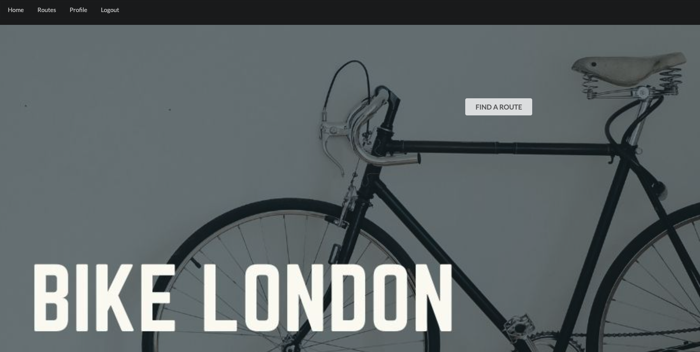
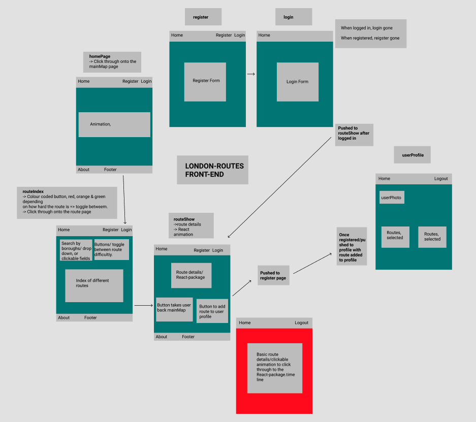

# London-Routes - GA Project Four 

London-Routes is a full stack application that allows Londoners to explore bike routes throughout the city. Users can browse different routes, add them to their profile and leave comments. 



### Goal and timeframe 

- 8 day solo project finishing with a fully functioning application.

### Technologies Used
- Python
- Django
- PostgreSQL
- React
- rest_framework
- Axios
- SASS
- Semantic UI React
- HTTP-proxy-middleware
- JSON Web Tokens
- PyJWT
- Git, and GitHub

### Process

- I spent the first chunk of time creating a wireframe and ERD, making sure I had a solid blueprint for this project. 

### Wireframe 



### Backend
- I started by building out the backend using Django / PostgreSQL. 

###  Model 
Different types of models created on the backend: 
- User
- Route
- Comment
- Direction

###  ERD Diagram 


Below is an example of an one-to-many model created or my comments. 
```
from django.db import models

class Comment(models.Model):
    text = models.TextField(max_length=150)
    created_at = models.DateTimeField(auto_now_add=True)
    route = models.ForeignKey(
        'routes.Route',
        related_name="comments",
        on_delete=models.CASCADE
    )
    owner = models.ForeignKey(
        'jwt_auth.User',
        related_name="posted_comments",
        on_delete=models.CASCADE, 
    )
    def __str__(self):
        return f'Comment - {self.id} on Routes - {self.routes}'

```
###  Challenges 

- I spent a lot of time getting the backend fully functioning and tested as I went, I found creating the correct relationships a challenged due to nesting / populating the correct models. 
- The time aspect of this project was also something I had to consider due to this I am still working on the frontend aspect now that I am happy with the backend functionality.

###  Wins
- A huge win for this project was developing the backend: creating the ERD and models, working with different data types, seeing it function on the frontend. 
- Implementing the comment functionality and getting the right data model on the backend. 

###  Reflection & Key Learning

- Creating a fullstack web application from scatch was a great learning curve in problem solving, backend development and frontend implementation. 
- Using a Django Rest Framework and serializers to convert model data to JSON.
- Using a Model-Template-View framework to structure my codebase on the back-end.

###  Future features 

- I am currently working on my comment functionality of this project. 
- Image upload for user profile and routes. 
- Deleting comments 
